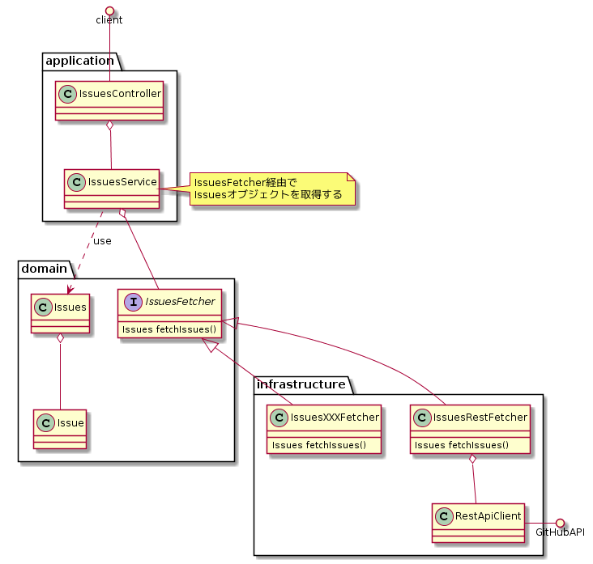

# springboot-issue-summary
[](https://circleci.com/gh/yuizho/springboot-issue-summary/tree/master)
[](https://codecov.io/gh/yuizho/springboot-issue-summary)

# 実行手順
## 必要環境
Docker(docker-composeコマンド)が使用できる環境で実行してください。

## サーバの起動
以下のコマンドを実行して、Dockerコンテナ上でJavaのAPIサーバ、MongoDB、Mongo Expressを起動してください。

※docker image [yuizho/springboot-issue-summary](https://cloud.docker.com/repository/docker/yuizho/springboot-issue-summary)はDockerHubへpush済みのものです。

```bash
$ git clone https://github.com/yuizho/springboot-issue-summary.git
$ cd springboot-issue-summary
$ docker-compose up
```

## APIの動作確認
任意のブラウザ、あるいはcurlなどのHttpクライアントツールを使用して、以下のURIへGETでアクセスしてください。

http://localhost:8080/api/issues?page=1&per_page=10

以下のようなjsonが返却されれば起動出来ている状態です。

```json
{
    "issues": [
        {
            "title": "Upgrade to",
            "body": ""
        },
        {
            "title": "Apply Tomc",
            "body": "<!--\r\nThanks for contributing "
        },
        {
            "title": "WebFlux an",
            "body": "Spring Boot Version: `2.0.5`\r\n"
        },
        {
            "title": "Task input",
            "body": "`BootJar`'s `bootInf` property"
        },
        {
            "title": "Improve Sp",
            "body": "We prepared article about migr"
        },
        {
            "title": "HealthEndp",
            "body": "Spring Boot version: 2.1.1\r\nMi"
        },
        {
            "title": "Suggestion",
            "body": "Hi,\r\n\r\nI would like to suggest"
        },
        {
            "title": "Test slice",
            "body": "It seems like a fairly minor c"
        },
        {
            "title": "Optimize S",
            "body": "Hi,\r\n\r\nas mentioned earlier to"
        },
        {
            "title": "Skip actua",
            "body": "I had a working Spring Boot 2."
        }
    ],
    "has_next": true
}
```

## HttpRequest, HttpResponseのログの確認
HttpRequest, HttpResponseのログはデータストア(MongoDB)へ格納される作りになっています。
ブラウザから以下のURLへアクセスすると、MongoDB向けのViewerでるMongo Expressを使って格納されたログを確認できます。

http://localhost:8081/db/log/logData

※なお、HttpRequest, HttpResponseのログ**改善の余地がある箇所**の章で記載していますが、HttpRequestのbodyの内容はうまくログ出力出来ていません。


# 作成したエンドポイントのインターフェース仕様
APIのパラメータ、レスポンスのインターフェース仕様については以下のドキュメントをご覧ください。

https://yuizho.github.io/springboot-issue-summary-doc/apidoc/


# 実装の内容について
## 使用したJavaバージョン、フレームワークなど
* Java: 11
* Spring Boot: 2.1.1.RELEASE

## 実装で工夫したポイントについて
### DDDを参考にして設計を行った
DDD(ドメイン駆動設計)の考え方を取り入れて、クラス設計を行いました。
レイヤアーキテクチャ、ヘキサゴナルアーキテクチャを特に意識して設計を行っています。



ドメイン(今回の課題でのIssue機能)の関心事である以下ようなロジックはドメインモデルであるIssueクラス、Issuesクラスへまとめています。
 * Issueのtitle, bodyの編集処理
 * ページネーション処理

ドメインモデルへロジックを集中させることで、アプリケーションレイヤーは薄く保つことが出来ています。
これにより、クライアントとのインターフェースまわりの仕様変更があった場合は、できるだけアプリケーションレイヤーの変更のみで対応できるようになっています。

また、ドメインレイヤーのパッケージ内に、Issueオブジェクトを取得するためのIssuesFetcherインターフェースを定義し、インフラストラクチャーレイヤー内でそのインターフェースを実装するようにしています。
アプリケーションレイヤーはIssuesFetcherインターフェースを参照しているだけなので、どのデータソースから情報が取得されるのかは知らずにIssuesオブジェクトを取得できるようになっています。

このおかげで、DI機能によるデータソースの切り替えも実装しやすくなっています(詳細は**プロパティファイルで取得するデータソースを切り替えられるようにした**をご覧ください)。


### プロパティファイルで取得するデータソースを切り替えられるようにした
application.propertiesファイル内の`data.source.type`の設定を変えることでデータソースを切り替えられるようにしました。
現在有効な設定は以下の2つです。
* `REST`: REST APIをデータソースとします。Issuesのデータ取得クラスとしてIssuesRestFetcherが使用され、GitHub APIからデータを取得します。
* `DEMO`: デモ用のデータソースです。Issuesのデータ取得クラスとして、IssuesDemoFetcherが使用されます。

これらのデータソースは、Component名を分けることでDI機能によって適切なクラスを取得できるようにしています。

```java
@Component("IssuesREST")
public class IssuesRestFetcher implements IssuesFetcher {
    // ...

@Component("IssuesDEMO")
public class IssuesDemoFetcher implements IssuesFetcher {
   // ...

@Service()
public class IssuesService {
    @Autowired
    private Map<String, IssuesFetcher> issuesFetchers;

    @Autowired
    private DataSourceProperties dataSourceProperties;

    public Issues fetchIssues(Optional<Integer> optPage, Optional<Integer> optPerPage) {
        String targetComponentName = "Issues" + dataSourceProperties.getType();
        // 適切なIssuesFetcherの実装を取得        
        // data.source.typeがRESTの場合はIssuesRestFetcherが使われ、
        // data.source.typeがDEMOの場合はIssuesDemoFetcherが使われる
        return issuesFetchers.get(targetComponentName).fetchIssues().asPaginated(optPage, optPerPage);
    }
}
```

### GitHub APIの返却値をキャッシュするようにした
Spring BootのCache機能を使用し、データソースがREST(GitHub API)の場合に3分ごとにGitHub APIへアクセスし、結果をキャッシュするIssuesRestCacheJobクラスを作成しました。

これによって、3分間最新の状態が取得出来ないものの、ローカルの環境であれば20ミリ秒程度で結果を取得できるようになっています。
また、基本的にGitHub APIのRate limiting(1時間ごとに60アクセスまで)の影響も受けずに情報を取得出来ます。

GitHub APIの制約の関係上一度のリクエストで100件までしか取得出来ないため、本APIは**open状態のissueのうち、最近作成されたissueを最大で100件を返却する**仕様となっています。
キャッシュの頻度を調整していけば、多少は最大返却数を増やすことができると思います。


### ページングのレスポンスを工夫した
本APIのクライアントが「次のページが存在するのかどうか」を判断しやすくする目的で、Jsonの返却値としてIssuesのリストの他にhas_next(bool)を返すようにしています。

※APIのインターフェース仕様に関しては以下のドキュメントをご覧ください。

https://yuizho.github.io/springboot-issue-summary-doc/apidoc/

## 改善の余地がある箇所
主に時間の関係で手を入れられなかった、改善が可能な箇所について記述したします。
* 現在はデフォルト設定でSpring BootのCache機能を使用しているため、ConcurrentHashMap内にキャッシュが保持される。
  * より実運用を見据えた実装にする場合、Redisなどにキャッシュしたほうが良いと思う。
* HttpRequestのログについて、bodyの内容が出力出来ていない。
  * Java 11のHttp Client実装を使用しているのですが、Bodyの情報を格納しているオブジェクト(BodyPublisher)がbodyの内容のtoString出力などに対応していないため。
* Htmlタグなどが含まれる可能性のある外部サイトからデータを撮ってきているため、ResponseのHeaderとして`X-Content-Type-Options: nosniff`をつけたほうがよい。
  * 調査不足だが、Spring Securityなどの機能を使うと一括で当該Headerをレスポンスに加えられるはず。
* BeanValidationでバリデーションエラーが発生した際に、status: 500エラーとしてレスポンスがかえってしまう。
  * ErrorHandlerなどで、ConstraintViolationExceptionが発生した際の処理を行えば対応可能と思われる。
